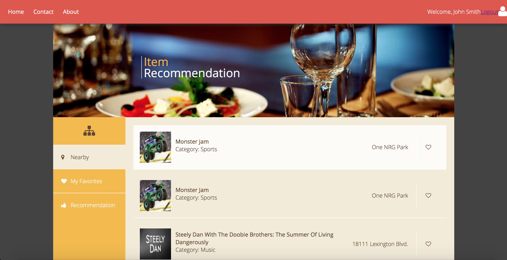

# Ticket-Plus

> Java Web Service Development: Events Search and Ticket Recommendation

[![Build Status][travis-image]][travis-url]
[![Downloads Stats][npm-downloads]][npm-url]

## FrontEnd
AJAX: HTML, CSS, JavaScript

## Servlets
Eclipse, Apache Tomcat, RESTful APIs

## Database
Relational DB: MySQL
NoSQL DB: MongoDB

## API
TicketMaster API

## Machine Learning Algorithm
Content-based recommendation

## Cloud
Amazon EC2
